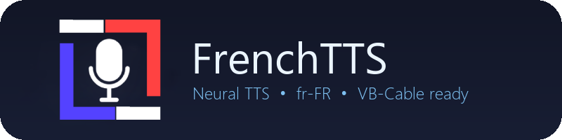

<p align="center">
  
</p>

<p align="center">
  
  
  
  
</p>

<p align="center">
  Realistic French TTS for Windows — no API key, no subscription, no compromise on voice quality.<br/>
  Built for VoiceChat via <strong>VB-Cable</strong> or any virtual audio device.
</p>

---

## Why FrenchTTS?

Finding a good French TTS in 2024 is surprisingly painful.

Most free solutions sound robotic, rely on outdated speech engines, or require you to paste text into a web interface and manually download the output. Paid alternatives _(ElevenLabs, Azure, Google Cloud)_ do sound great — but they all require an API key, a credit card, and start billing once you exceed a free tier.

On the open-source side, offline models like Kokoro or XTTS exist, but they demand a GPU, several GB of model weights, and non-trivial setup just to get started.

**FrenchTTS bridges that gap.** It uses Microsoft Edge's neural TTS engine — the same one powering the Read Aloud feature built into Edge browser — through the `edge-tts` library. No account, no key, no install beyond `pip`. The voices are genuinely neural-quality, indistinguishable from a paid service for most use cases, and the latency is low enough for real-time roleplay.

The app wraps it in a clean dark-mode desktop UI with audio device routing, so you can pipe the output directly into voicechat (Discord, FiveM, TeamSpeak, ...) via VB-Cable without touching any config file or third-party tool.

---

## Features

- **Neural voices** — 8 French voices (female & male) streamed from Microsoft Edge, no key required
- **Device selector** — route audio to any output, auto-detects VB-Cable
- **Voice controls** — adjustable speed, volume, and pitch
- **Input history** — navigate previous texts with `↑` / `↓` (shell-style)
- **Replay** — one-click or configurable hotkey (default `F2`) replays the last speech
- **System tray** — minimizes to tray, restores on double-click
- **Acrylic blur** — Windows 10/11 native background blur with adjustable opacity
- **Persistent config** — all settings and history saved in `%APPDATA%\FrenchTTS`
- **Buildable as `.exe`** — single-file PyInstaller bundle via `build.bat`

---

## Voices

| Name    | Gender | Voice ID              |
| ------- | ------ | --------------------- |
| Denise  | Female | `fr-FR-DeniseNeural`  |
| Eloise  | Female | `fr-FR-EloiseNeural`  |
| Henri   | Male   | `fr-FR-HenriNeural`   |
| Alain   | Male   | `fr-FR-AlainNeural`   |
| Claude  | Male   | `fr-FR-ClaudeNeural`  |
| Jerome  | Male   | `fr-FR-JeromeNeural`  |
| Maurice | Male   | `fr-FR-MauriceNeural` |
| Yves    | Male   | `fr-FR-YvesNeural`    |

All voices are French (France), neural quality, streamed in real time.

---

## Requirements

- Windows 10 / 11
- Python 3.10+
- Internet connection (voices stream from Microsoft's Edge TTS servers)

---

## Quick start

##### Automatically

```bash
# Clone and launch — dependencies install automatically
git clone https://github.com/FrenchTTS/FrenchTTS.git
pushd FrenchTTS
launch.bat
```

##### Manually

```bash
pip install -r requirements.txt
python main.py
```

---

## Build as .exe

```bash
build.bat
```

Produces `dist/FrenchTTS.exe` as a self-contained single-file executable.
Requires `img/icon.ico` to be present before building.

---

## Usage

| Action            | How                                |
| ----------------- | ---------------------------------- |
| Speak text        | Type → `Enter` or click **Parler** |
| Insert newline    | `Shift + Enter`                    |
| Stop playback     | **Arrêter**                        |
| Replay last audio | **Redire (F2)** or press `F2`      |
| Navigate history  | `↑` / `↓` in the text box          |
| Open settings     | **⚙ Paramètres**                   |
| Minimize to tray  | Minimize the window                |

---

## VB-Cable setup

Example with [Discord](https://discord.com) App.

1. Install [VB-Audio Virtual Cable](https://vb-audio.com/Cable/)
2. In FrenchTTS → **⚙ Paramètres** → **Sortie** → `CABLE Input (VB-Audio Virtual Cable)`
3. In Discord → Settings → Voice → **Input Device** → `CABLE Output (VB-Audio Virtual Cable)`

The TTS audio will now play through your VB-Audio Virtual Cable or other microphone.

---

## Data & file structure

```
%APPDATA%\FrenchTTS\
├── config.json        # voice, device, sliders, hotkey, opacity
└── history\
    ├── last.mp3       # most recently generated audio
    └── lasts.log      # spoken text history (JSON array, max 100 entries)
```

```
FrenchTTS/
├── img/
│   ├── icon.ico
│   ├── icon.png
│   └── logo.png
├── main.py
├── requirements.txt
├── launch.bat
└── build.bat
```

---

## Dependencies

| Package         | Role                                    |
| --------------- | --------------------------------------- |
| `edge-tts`      | Neural TTS via Microsoft Edge servers   |
| `customtkinter` | Modern dark-mode UI                     |
| `sounddevice`   | PCM playback with per-device routing    |
| `miniaudio`     | In-memory MP3 decode (no ffmpeg needed) |
| `numpy`         | PCM buffer handling                     |
| `pystray`       | System tray icon                        |
| `Pillow`        | Tray image fallback                     |

---

## License

MIT — © [FrenchTTS](https://frenchtts.github.io)
